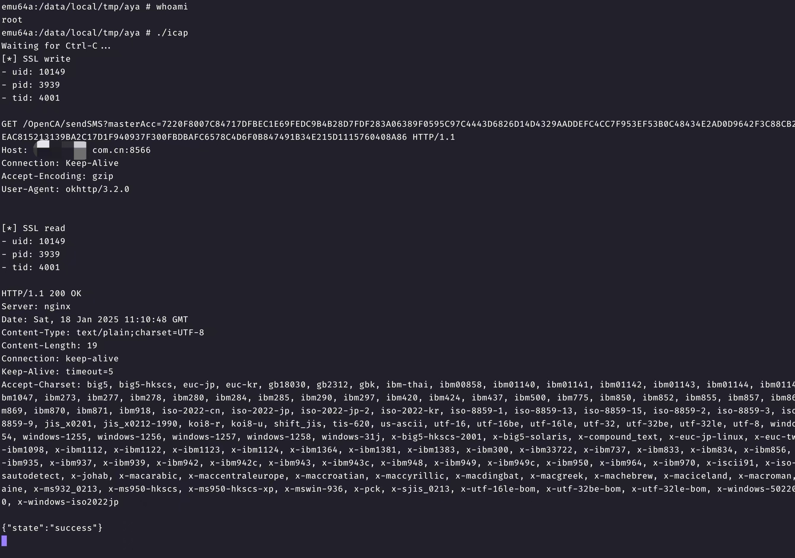

# icap

简易的Android eBPF抓包工具
使用rust编写
macOS(arm)下编译通过

## 快速开始

注意: 需要root权限

注意: 目前仅支持64位架构

注意: 在不支持BTF(BPF Type Format)的内核上无法顺利运行

下载编译好的程序 放到可执行目录下 以root权限运行

运行截图:


## 环境准备

1. 安装rust工具链: `rustup toolchain install stable`
2. 安装rust工具链每夜版: `rustup toolchain install nightly --component rust-src`
3. (交叉编译环境) 目标架构: `rustup target add aarch64-unknown-linux-musl`
4. (交叉编译环境) LLVM: `brew install llvm`
5. (交叉编译环境) musl C 工具链: [`brew install filosottile/musl-cross/musl-cross`](https://github.com/FiloSottile/homebrew-musl-cross)
6. bpf-linker (参考aya官方文档): `LLVM_SYS_180_PREFIX=$(brew --prefix llvm) cargo install --no-default-features bpf-linker`

## macOS上为Android交叉编译

```shell
CC=aarch64-linux-musl-gcc cargo build --release --target=aarch64-unknown-linux-musl --config=target.aarch64-unknown-linux-musl.linker=\"aarch64-linux-musl-gcc\"
```

生成的程序位于 `target/aarch64-unknown-linux-musl/release/icap`

## 在Android上运行

```shell
adb push target/aarch64-unknown-linux-musl/release/icap /data/local/tmp/aya/
adb shell

cd /data/local/tmp/aya
# RUST_LOG=info ./icap
./icap
```
